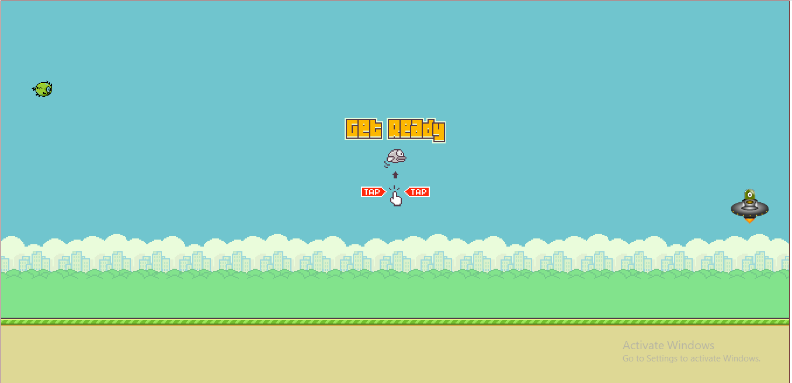
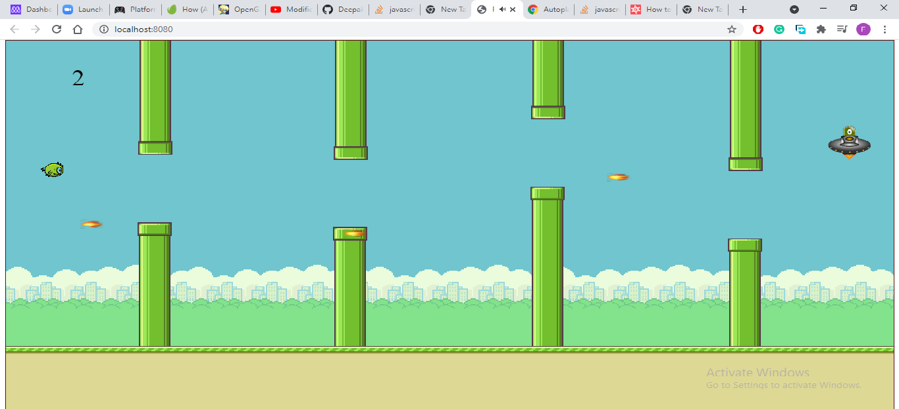
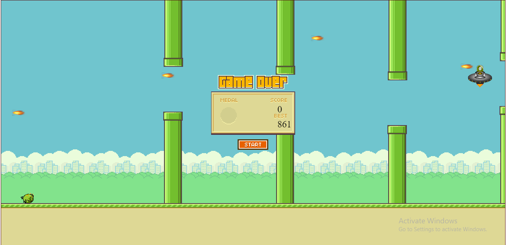

# FLAPPY_GAME
  Help this monster bird to fly across the pipes while defending from bullet.

## Game Instructions
Click the mouse button to jump and avoid the pipes and bullet coming from alien spaceship.
[Click here to play the game](https://deepakdanger.github.io/Flappy_game/)</p>







## Built With
- Phaser  
- Javascript
- Webpack
- CSS Bootstrap

## Live Demo

Click on the link below for accessing the deployed website.
### [FLAPPY GAME](https://lit-coast-37479.herokuapp.com/)</p>


## Getting Started

To get a local copy up and running follow these simple example steps.

### Prerequisites
- A browser
- Node js (optional)

### Setup

All code below are for a terminal.

1. Clone repository: 
```sh
  $ git clone https://github.com/Deepakdanger/Flappy_game.git
```
2. Change directory inside project
```sh
cd Flappy_game
```
3. In your terminal, run 
```sh
npm install
```
4. After changes, run webpack to build production code.
```sh
npm run build
```
5. You can now open the `index.html` file in `dist folder` in any browser.
   
6. You can also run the following to access the website on `http://localhost:8080` in your local computer.
```sh
npm run serve
```
* Press `Ctrl + c` to exit the `npm run serve` session in your terminal.

### Testing the application

* Run the command to run tests
```sh
  npm run test
```
* Press `q` to exit the test session
* Press `a` to run the tests again.

## Author


👤 **DEEPAK KUMAR**
- GitHub: [@githubhandle](https://github.com/Deepakdanger)

## 🤝 Contributing

Contributions, issues, and feature requests are welcome!

Feel free to check the [issues page](https://github.com/Deepakdanger/Flappy_game/issues).

## Show your support

Give a ⭐️ if you like this project!

## Acknowledgments

- Hat tip to anyone whose code was used
- Inspiration
- etc

## 📝 License

This project is [MIT](/LICENSE) licensed.